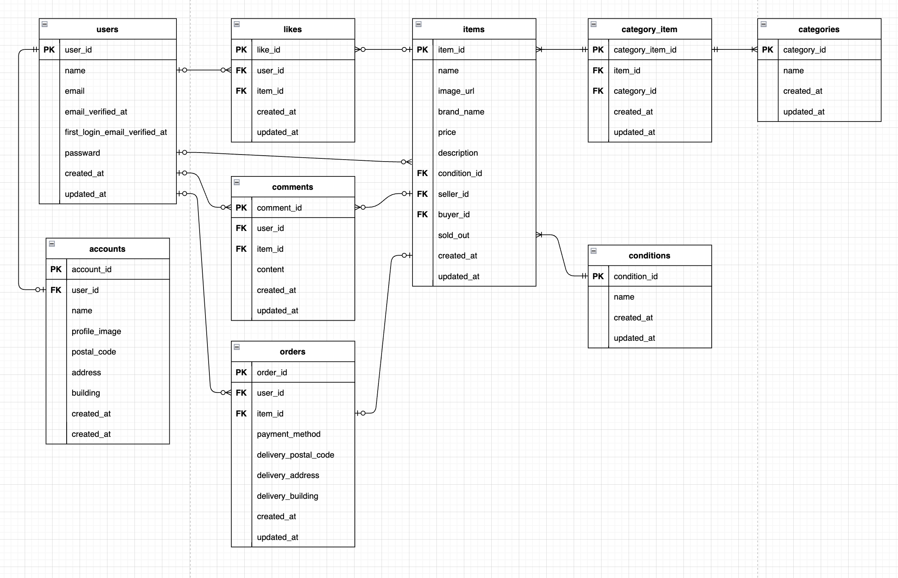

# フリマアプリ

## 環境構築

### Dockerビルド

```bash
git clone https://github.com/komody/hurima-app
cd hurima-app
docker compose up -d --build
```

### Laravel環境構築

```bash
docker compose exec php bash
cd /var/www
composer install
cp .env.example .env
```

`.env` の環境変数を以下のように設定してください。

```
DB_HOST=mysql
DB_DATABASE=laravel_db
DB_USERNAME=laravel_user
DB_PASSWORD=laravel_pass
MAIL_HOST=mailhog
MAIL_PORT=1025
```

`Stripe ダッシュボード` の テストモード で取得した STRIPE_KEY と STRIPE_SECRET を .env に設定してください

```
STRIPE_KEY=（Stripeダッシュボードで取得した公開可能キー）
STRIPE_SECRET=（Stripeダッシュボードで取得したシークレットキー）
```

```bash
php artisan key:generate
php artisan storage:link
php artisan migrate
php artisan db:seed
npm install
npm run dev
exit
```

## テスト実行

### 準備（初回のみ）

```bash
docker compose exec php bash
cd /var/www
cp .env.testing.example .env.testing
exit
```

`.env.testing` の `APP_KEY` を `.env` の `APP_KEY` で上書きしてください。

```bash
# 初回のみ: laravel_test を作成
docker compose exec mysql mysql -u root -proot -e "CREATE DATABASE laravel_test"
```

### テスト実行

```bash
docker compose exec php php artisan test
```

## 開発環境

| 画面 | URL |
|------|-----|
| トップ（商品一覧） | http://localhost/ |
| 会員登録 | http://localhost/register |
| ログイン | http://localhost/login |
| phpMyAdmin | http://localhost:8080/ |
| MailHog（メール確認） | http://localhost:8025/ |

## 使用技術(実行環境)

- PHP 8.1
- Laravel 8.x
- MySQL 8.0.26
- nginx 1.21.1
- Node.js 18.x
- Laravel Mix（Sass）
- Stripe（決済）

## ER図



## URL

- 開発環境: http://localhost/
- 会員登録: http://localhost/register
- ログイン: http://localhost/login
- phpMyAdmin: http://localhost:8080/
- MailHog（メール確認）: http://localhost:8025/
